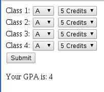
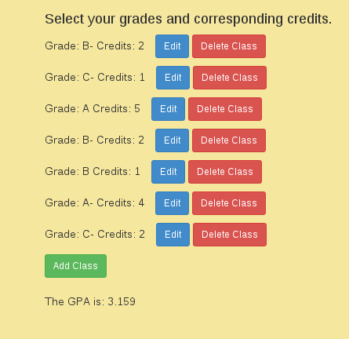

Jacob Opdahl & Peter Hanson - Lab 4

***4 Specific Resources:***
-=-=-=-=-=-=-=-=-=-=-=-=-=-=-=-=-=-=-

purecss.io/buttons/
- Used this for styling ideas for our buttons.

http://stackoverflow.com/questions/15410652/using-ng-repeat-and-ng-class-on-rows-inside-a-table
- Used this to figure out if we could use repeat in a table.

http://stackoverflow.com/questions/19520144/angularjs-bind-data-to-select-drop-down-when-the-value-of-another-select-drop-do
- Used to help figure out how to display the value selected on a given dropdown button.

http://jsfiddle.net/
- Was directed to this site by several Stack Overflows to be shown examples of working Angularjs. Could be helpful with experimenting before implementation.

-=-=-=-=-=-=-=-=-=-=-=-=-=-=-=-=-=-=-

***Attempts to make Angular Tests Work:***
-=-=-=-=-=-=-=-=-=-=-=-=-=-=-=-=-=-=-
https://docs.angularjs.org/guide/unit-testing
- Started here while looking for a testing tutorial. Fouund the documentation for testing
AngularJS. This turns out to not be all that helpful unless you have a mastery of Angular
due to the technicality.
Attempted to write a test based on the section titled Passing in Dependencies. See attempt is tests.js.
Got the test written in the format shown in the Angular Documentation. Did not know how to run it. After writing,
it still doesn't seem like the type of test we are going for with making the test look at the HTML page.
It seems more like a typical mocha page. Not sure where to go from here.
Commented it out so it doesn't interfere.

http://andyshora.com/unit-testing-best-practices-angularjs.html
-This website seemed like it might be useful if you had all the proper tools installed. Like most, it doesn't seem
to show all the components you actually would want to see to understand entirely what is going on with the tests.

*Questions:
I would like to know what it means to actually test Angular again.
Could you explain what we are going for with it in class?

*What we think might be testable with AngularJS:
Once it works, we think we can test clicking a value for grade and making sure it binds to one of the elements
in our classes array based on which button was pushed. The same goes for credits.
Also, we believe we could use Angular testing (if we are understanding it right) to see if calculate GPA
data binds properly to the place where it is displayed.
Testing these points would essentially test all the main functionality (if not ALL the functionality) of our
GPA calculator where it ties in with the view-model through data-binding.

-=-=-=-=-=-=-=-=-=-=-=-=-=-=-=-=-=-=-

AngularGP ALab
===============
There are several goals in this lab:
   * Understand how to use Angular to create views and view-models
   * Understand the structure of an Angular app that makes sense
   * Understand how the HTML and Angular parts of the view relate to each other
   * Writing at least a couple tests in Mocha or Jasmine that can test your Angular code
   * Continue using HTML and CSS to make a page look decent and contain information you care about
   * Continue using Mocha tests (or, if you find it simpler, you may switch to another language or framework for testing)

This starter code is meant to give you a structure where you can put your work. Your job is to create a fairly basic GPA calculator that allows a user to enter the grades and number of credits for 4-6 classes and displays the correct GPA for the user. This week, your main struggle should be figuring out how to test Angular code. The 20 points for writing two tests shoudl be an indication of how important I think this struggle really is. I have a start of a test here from the video linked below, but I am still getting an error about the window not being defined. My test may be something you end up completely ignoring, but I wanted to at least put something there as a start.

How you will be graded for this lab
===================================
You will earn points for:
   * (3 points) Consistent commits with pushes every-so-often
      * Commit and push right away to make sure everything worked correctly for your clone.
      * Your commits should be small - every time you make a test pass, every time you add a feature, every time you update your textual description of your code with details about the Angular... commit!
   * (3) Good commit statements - This is a little bit subjective, but I'm looking for commits that actually explain how the project is different as a result fo the work you did.
   * (10 points) You allow a user to enter information about 4-6 courses (using Angular).
   * (10 points) You utilize the data supplied by the user to calculate and display the correct GPA (using Angular).
   * (20 points) Make tests for at least two of your Angular features.
   * (4 points) Explain a little bit about what your tests are checking.
   * (4 points) Include a list of at least 4 specific resources you found useful for completing the work in this lab (1 point for each). You may include more, but you will only get points for 4.

Setup
=====
   * Fork this project
   * Clone your forked repo to open the project in WebStorm
   * in the terminal: <code>npm install</code>
   * in the terminal: <code>bower install</code> (might need to be this> <code>./node_modules/bower/bin/bower install</code>)
   * set up nodemon:
      * A link to the github project can be found here: https://github.com/remy/nodemon
      * In this project, we have already installed nodemon, and it should be listed in package.json. If not: Install nodemon: <code>npm install --save-dev nodemon</code>
      * Configuration
        * You need to edit your configurations to create a nodemon configuration. Click the edit configurations in the upper right of the window (or under the 'Run' menu in the menubar).
        * Start by adding a new configuration (click the '+') with a node.js template. Set the javascript application to app.js (or server.js, depending on what you call it). You then need to have it run with the CoffeeScript plugin (even though we are not using CoffeeScript).
        * Set the path to the coffee executable to /node_modules/nodemon/bin/nodemon.js
        * Make sure you set the CoffeeScript parameters to <code>-e html,js,css,json</code> This tells nodemon to restart the server whenever a file with one of these extensions changes. (You may want to add other extensions if you use them frequently).

Some resources
==============
   * https://thinkster.io/egghead/testing-overview/ - video of testing a filter

GPA Calculator Image Examples
=============================

